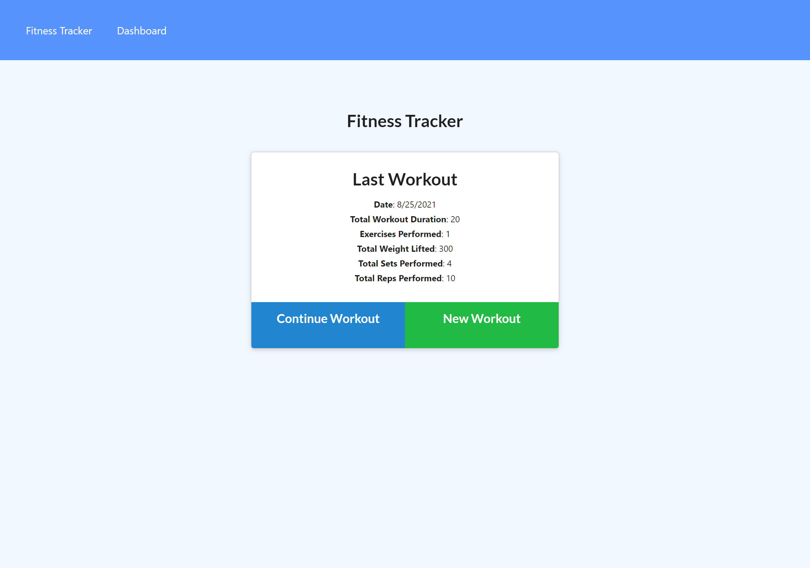
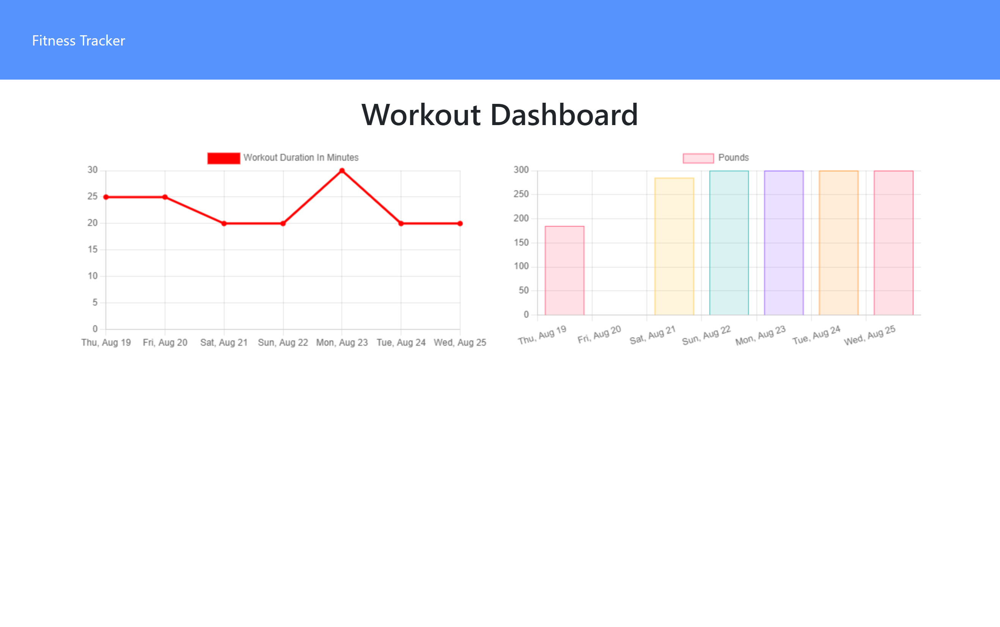

# fitnessTracker
Workouts are always better when you keep track of them!

[Live site!](https://fitness-tracker-mmonyok.herokuapp.com/)

## Description
- Exercising on a regular basis is hard; keeping track of your workouts is even harder.
- This app makes keeping track of your 7 most recent workouts easier. 
- I learned how to implement MongoDB into front-end to manage data and display it.

## Table of Contents
- [fitnessTracker](#fitnesstracker)
  - [Description](#description)
  - [Table of Contents](#table-of-contents)
  - [Installation](#installation)
  - [Usage](#usage)
  - [Credits](#credits)
  - [License](#license)
  - [Contributing](#contributing)
  - [Tests](#tests)
  - [Contact](#contact)

## Installation
1. Provided that you have a code editor of your choosing installed on your system, such as VS Code (https://code.visualstudio.com/),

2. Provided that you have a Terminal installed for Windows (https://www.microsoft.com/en-us/p/windows-terminal/9n0dx20hk701?rtc=1&activetab=pivot:overviewtab) or are using a Mac with Terminal installed with the OS,

3. Provided that you have npm and Node.js installed for windows (https://www.npmjs.com/get-npm),

4. Provided you have Git and Github Desktop installed (https://git-scm.com/downloads, https://desktop.github.com/) and have registered for an account,

5. Provided you have MongoDB and Compass installed (https://www.mongodb.com/),

6. Either Clone or Fork this repository: (https://github.com/mmonyok/fitnessTracker.git),

7. After cloning the repository to your local computer, initialize npm, as well as install express, mongoose, and morgan node modules. 

## Usage
- To start a workout, click on "New Workout" and select whether you are doing resistance or cardio training from the dropdown.
- Fill out the exercise details; click "Complete" if you are not entering anymore exercises or "Add Exercise" if you need to add additional exercises.
- Back on the main page, some details of your most recent workout will be displayed. If you would like to continue that workout, you can select "Continue Workout" to add additional exercises to that workout.
- Click on "Dashboard" to see some data graphs of the most recent 7 workouts.

## Credits

- Technologies Used:
  - [HTML](https://www.w3schools.com/html/)
  - [CSS](https://www.w3schools.com/css/)
  - [JavaScript](https://www.w3schools.com/js/)
  - [Node.js](https://www.npmjs.com/get-npm)
  - [NPM](https://www.npmjs.com/get-npm)
  - [Express.js](https://expressjs.com/)
  - [mongoose Node Module](https://www.npmjs.com/package/mongoose)
  - [morgan Node Module](https://www.npmjs.com/package/morgan)

- Tutorials Followed:
[Professional README guide template provided by Coding Boot Camp.](https://github.com/coding-boot-camp)

## License
MIT License

Copyright (c) [2021] [Melody Monyok]

Permission is hereby granted, free of charge, to any person obtaining a copy
of this software and associated documentation files (the "Software"), to deal
in the Software without restriction, including without limitation the rights
to use, copy, modify, merge, publish, distribute, sublicense, and/or sell
copies of the Software, and to permit persons to whom the Software is
furnished to do so, subject to the following conditions:

The above copyright notice and this permission notice shall be included in all
copies or substantial portions of the Software.

THE SOFTWARE IS PROVIDED "AS IS", WITHOUT WARRANTY OF ANY KIND, EXPRESS OR
IMPLIED, INCLUDING BUT NOT LIMITED TO THE WARRANTIES OF MERCHANTABILITY,
FITNESS FOR A PARTICULAR PURPOSE AND NONINFRINGEMENT. IN NO EVENT SHALL THE
AUTHORS OR COPYRIGHT HOLDERS BE LIABLE FOR ANY CLAIM, DAMAGES OR OTHER
LIABILITY, WHETHER IN AN ACTION OF CONTRACT, TORT OR OTHERWISE, ARISING FROM,
OUT OF OR IN CONNECTION WITH THE SOFTWARE OR THE USE OR OTHER DEALINGS IN THE
SOFTWARE.

## Contributing
- Please submit any contributions you think will improve this project.

## Tests
- No further testing is needed, unless any new contributions are made; the owner of this project will locally test any contribution submissions prior to approval.

## Contact
- Melody Monyok
  - <monyokwebdev@gmail.com>
  - (612) 492-1528